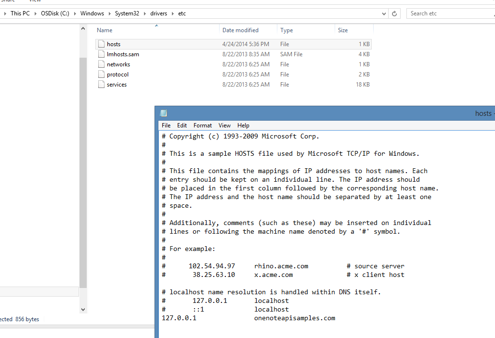
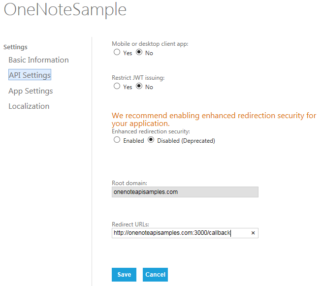

## OneNote API Node.js Sample README

Created by Microsoft Corporation, 2014. Provided As-is without warranty. Trademarks mentioned here are the property of their owners.

### API functionality demonstrated in this sample

The following aspects of the API are covered in this sample. You can 
find additional documentation at the links below.

* [Log-in the user](http://msdn.microsoft.com/EN-US/library/office/dn575435.aspx)
* [POST simple HTML to a new OneNote QuickNotes page](http://msdn.microsoft.com/EN-US/library/office/dn575428.aspx)
* [POST multi-part message with image data included in the request](http://msdn.microsoft.com/EN-US/library/office/dn575432.aspx)
* [POST page with a URL rendered as an image](http://msdn.microsoft.com/EN-US/library/office/dn575431.aspx)
* [POST page with HTML rendered as an image](http://msdn.microsoft.com/en-us/library/office/dn575432.aspx)
* [POST page with a PDF file rendered and attached](http://msdn.microsoft.com/EN-US/library/office/dn655137.aspx)
* [Extract the returned oneNoteClientURL and oneNoteWebURL links](http://msdn.microsoft.com/EN-US/library/office/dn575433.aspx)

### Prerequisites

**Tools and Libraries** you will need to download, install, and configure for your development environment. 

* [Node.js](http://nodejs.org/download)
* [Express framework for Node.js](http://expressjs.com)
* You have a normal URL with hostname (not just an IP address) to use for the Redirect URL. If you run this from your own desktop, you'll need to modify your Hosts file (in C:\Windows\System32\drivers\etc for Windows machines and /private/etc for Macs) and map your local server IP address to a new domain name, as in the following example.
 

**Accounts**

* As the developer, you'll need to [have a Microsoft account and get a client ID string](http://msdn.microsoft.com/EN-US/library/office/dn575426.aspx) 
so your app can authenticate with the Microsoft Live connect SDK.
* As the user of the sample, you'll need a Microsoft account so the OneNote API can 
send the pages to your OneDrive.

### Using the sample

After you've setup your web server described above,....

1. Download the repo as a ZIP file to your local computer, and extract the files. Or, clone the repository into a local copy of Git. 
2. Go to the [Microsoft app registration page](https://account.live.com/developers/applications/index).
3. On the API Settings page, set Mobile or desktop setting to No.
4. Set the Redirect URI to the domain name of your web site, as in the following example. The root domain name must be unique, so if you use one domain for testing and another for production, you'll need to register separate client ids and secrets for each domain.

5. On the App Setting page, copy the client ID and secret into the config.js file. 
6. Open a command prompt and go to the root directory of the project. 
7. Setup project dependencies with the `npm install` command.
8. Run the app with the `npm start` command.
9. Open a browser and navigate to the app running by default on port 3000.
10. Login using your Microsoft account, and allow the app to create pages in your OneNote notebooks.

### Version info

This is the initial public release for this code sample.

  
### Learning more

* Visit the [dev.onenote.com](http://dev.onenote.com) Dev Center
* Contact us on [StackOverflow (tagged OneNote)](http://go.microsoft.com/fwlink/?LinkID=390182)
* Follow us on [Twitter @onenotedev](http://www.twitter.com/onenotedev)
* Read our [OneNote Developer blog](http://go.microsoft.com/fwlink/?LinkID=390183)
* Explore the API using the [apigee.com interactive console](http://go.microsoft.com/fwlink/?LinkID=392871).
Also, see the [short overview/tutorial](http://go.microsoft.com/fwlink/?LinkID=390179). 
* [API Reference](http://msdn.microsoft.com/en-us/library/office/dn575437.aspx) documentation
* [Debugging / Troubleshooting](http://msdn.microsoft.com/EN-US/library/office/dn575430.aspx)
* [Getting Started](http://go.microsoft.com/fwlink/?LinkID=331026) with the OneNote API

  This project has adopted the [Microsoft Open Source Code of Conduct](https://opensource.microsoft.com/codeofconduct/). For more information see the [Code of Conduct FAQ](https://opensource.microsoft.com/codeofconduct/faq/) or contact [opencode@microsoft.com](mailto:opencode@microsoft.com) with any additional questions or comments.
